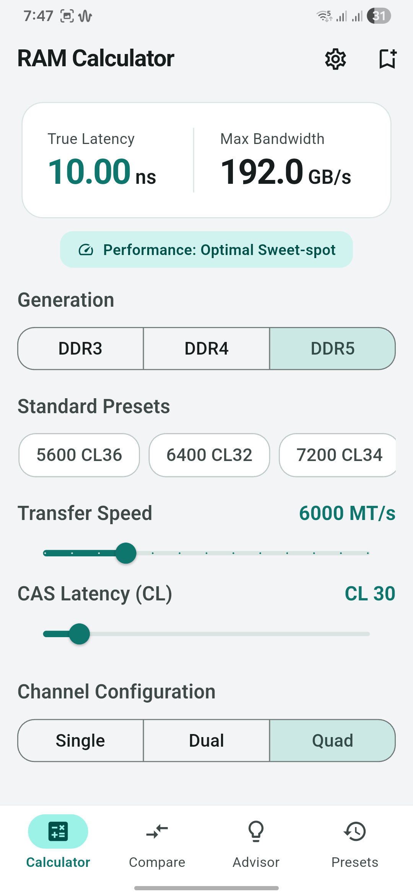
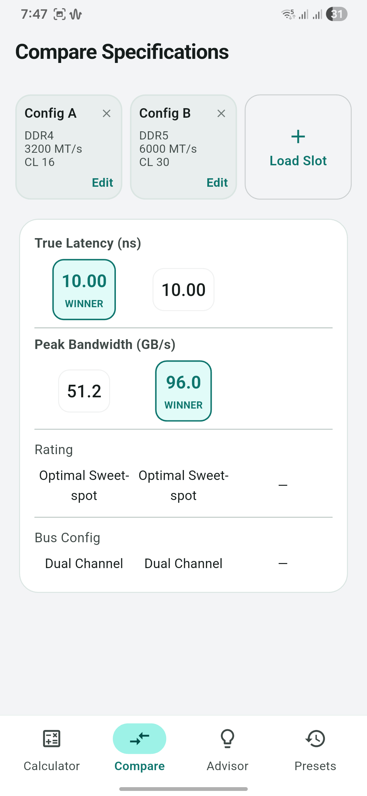
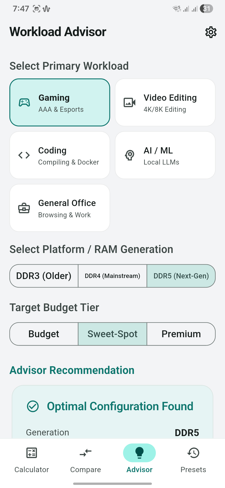

  

<h2 align="center">RamAdvisor</h2>

  A material-designed RAM speed calculation, benchmark, and workload diagnosis utility.

  
  &nbsp;&nbsp;&nbsp;&nbsp;
  
  &nbsp;&nbsp;&nbsp;&nbsp;
  

---
# RamAdvisor

RamAdvisor is a hardware utility designed to calculate real-world RAM performance metrics, facilitate side-by-side specification comparisons, and diagnose optimal memory configurations for various computing workloads.

---

## Distribution Model & Privacy

*   **Free Forever**: This application is distributed completely free of charge. It contains no advertisements, no in-app purchases, and no monetization.
*   **Closed Source**: Only the compiled, release-ready APK is distributed through this repository. The source code is private.
*   **Offline First**: All database and calculation operations run locally on your device via SQLite. The app requires zero network permissions, ensuring complete data privacy.

---

## How to Install

1.  Navigate to the **[Releases](https://github.com/Rhythm2310/Ram-Advisor/releases)** tab on the right side of this repository.
2.  Download the latest compiled `ram_advisor_release.apk`.
3.  Open the downloaded APK on your Android device to install the app.
    *   *Note: If prompted by your system, enable "Install from Unknown Sources" or "Allow installation from this source" in your security settings.*

---

## Core Functionality

### Latency & Bandwidth Calculator
*   **Snap-to-Standard Sliders**: Slide adjustments snap automatically to standard JEDEC, XMP, and EXPO clock speeds (DDR3, DDR4, and DDR5), eliminating non-standard fractional results.
*   **Exact Metric Solvers**: Computes True Latency (ns) and Peak Bandwidth (GB/s).
*   **Input Safety Guards**: Zero-safety protections prevent app crashes in the case of invalid memory metrics.

### Specification Comparison Grid
*   **Absolute Multi-Column Grid**: Aligns up to three memory configurations vertically, ensuring metrics correspond exactly to their headers.
*   **Winner Indication**: Automated calculations flag the performance winner for latency and bandwidth metrics respectively.

### Diagnostic Workload Advisor
*   **Benchmark-Backed Logic**: Diagnostic matching is backed by physical testing and memory controller limitations across modern architectures.
*   **Workload Mapping**: Suggests capacity, clock, latency, and bus combinations tailored to your generation, budget, and task (Gaming, Video Editing, Software Development, local AI/ML, or Office Productivity).

### Bangla Seasonal Themes
Includes six distinct visual palettes honoring the Bangladeshi seasons, with toggles for Light, Dark, and AMOLED (pure black) modes:
*   **Grishsho (Summer)**: Amber gold and warm sand.
*   **Borsha (Monsoon)**: Deep indigo and water teal.
*   **Shorot (Autumn)**: Sky blue and mint kashful.
*   **Hemonto (Late Autumn)**: Harvest bronze and tan paddy.
*   **Sheet (Winter)**: Foggy graphite and cozy burgundy.
*   **Boshonto (Spring)**: Bright pink and lime leaf.

---

## Technical Feedback & Support

### Bug Reports & Feature Requests
If you encounter runtime layout issues, mathematical anomalies, or have suggestions for new features (such as newer memory configurations, or expanded diagnostic workloads), please submit a ticket on our official GitHub Issues page. Your feedback directly impacts future maintenance releases.

---

## License

This software is distributed under a proprietary Freeware License. Refer to the separate `LICENSE` file in the root of this repository for exact terms of use and distribution limits.
